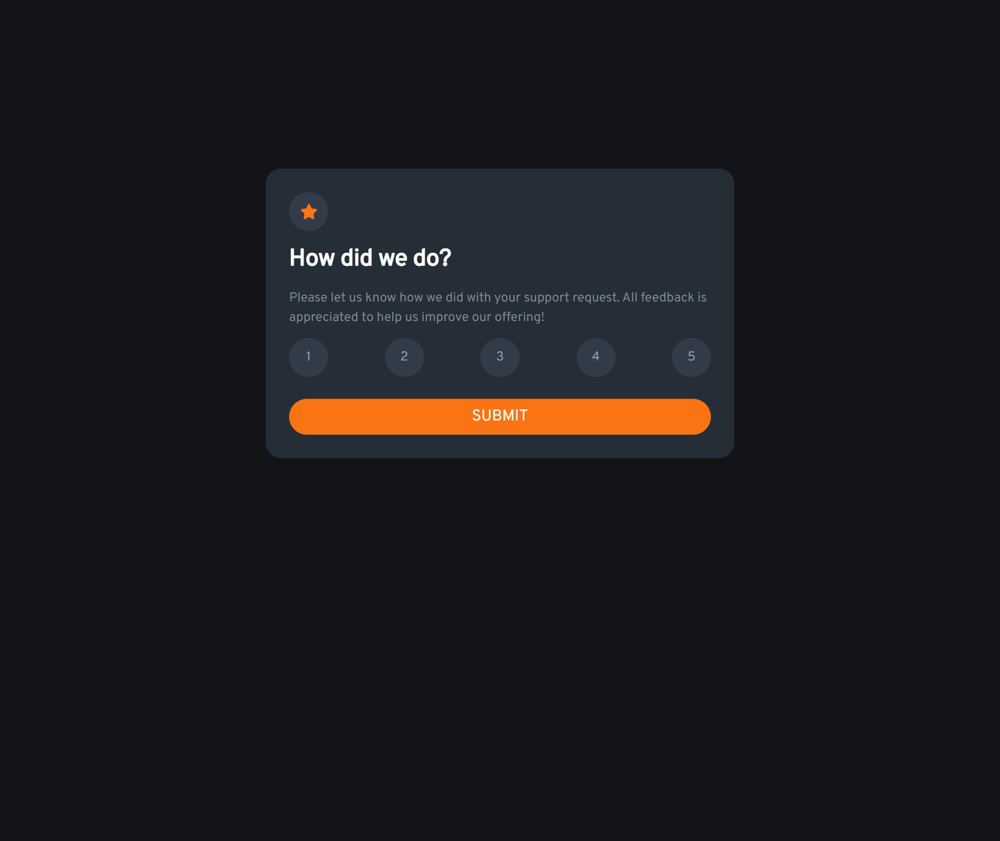

# Frontend Mentor - Interactive rating component solution

This is a solution to the [Interactive rating component challenge on Frontend Mentor](https://www.frontendmentor.io/challenges/interactive-rating-component-koxpeBUmI). Frontend Mentor challenges help you improve your coding skills by building realistic projects. 

## Table of contents

- [Overview](#overview)
  - [Screenshot](#screenshot)
  - [Links](#links)
- [My process](#my-process)
  - [Built with](#built-with)
- [Author](#author)

## Overview

### Screenshot

[mobile screenshot](./screenshots/mobile-screenshot.png)

### Links

- Solution URL: [https://github.com/hamze-kabi/interactive-rating-component](https://github.com/hamze-kabi/interactive-rating-component)
- Live Site URL: [https://hamze-kabi.github.io/interactive-rating-component/](https://hamze-kabi.github.io/interactive-rating-component/)

## My process

### Built with

- Semantic HTML5 markup
- CSS custom properties
- Flexbox
- Mobile-first workflow
- Javascript

## Author

- Email - [hamzekabinasab@gmail.com](mailto:hamzekabinasab@gmail.com)
- Github - [https://github.com/hamze-kabi/](https://github.com/hamze-kabi/)

